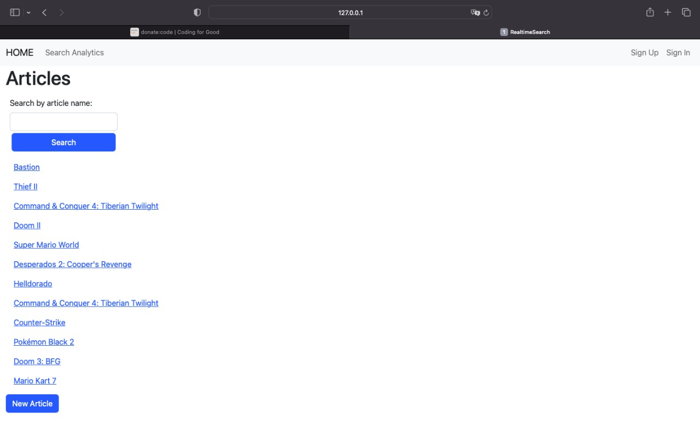
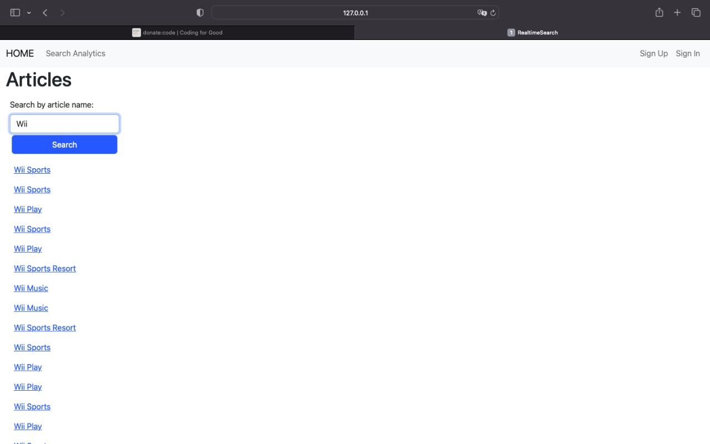
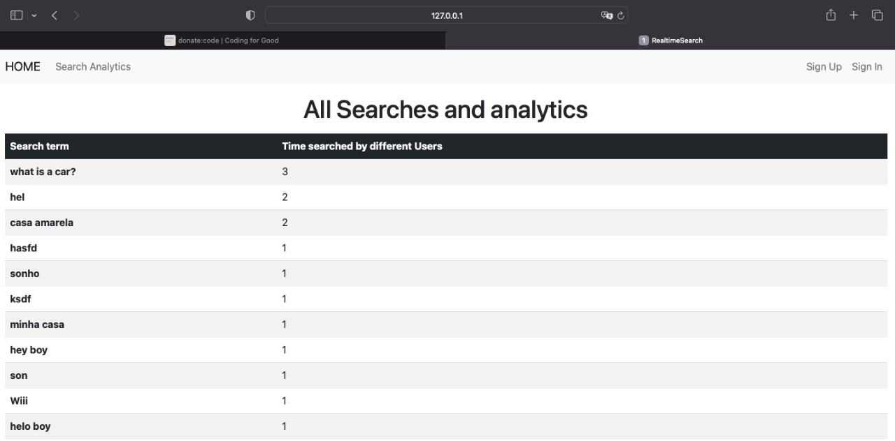

This is a Project I got from a company called Helpjuice as part of their interview process.
I was asked to create a blog App with a realtime search box in it, where users search articles, and then to have analytics that display what users were searching for.
My goal was to record their input in realtime and ultimately display analytics & trends on what people are searching for the most. I was asked to finish the whole project within 48 hours. Unfortunately, I couldn't finish the project on time. Due to this, I didn't make it to the next stage of their interview process.

## Screenshot




  
- [Ruby](https://www.ruby-lang.org/en/) 3.0.1
- [Rails](https://guides.rubyonrails.org/getting_started.html) 7.0.4
- [PostgreSQL](https://www.postgresql.org/)
  - [Gems](https://rubygems.org/)
  - [Devise](https://github.com/heartcombo/devise)
  - [Fuzzy-string-match](https://github.com/kiyoka/fuzzy-string-match)
  - [Stimulus-rails](https://github.com/hotwired/stimulus-rails)
  - [Faker](https://github.com/faker-ruby/faker)

## Initial settings to run the project

```bash
# clone the project
git clone https://github.com/ixboy/realtime_search.git

# enter the cloned directory
cd realtime_search

# install Ruby on Rails dependencies
bundle install

# install Node dependencies
yarn install

# create the development and test databases
rails db:create

# create the tables
rails db:migrate

# populate data
rails db:seed

# run the project
./bin/dev
```

### Prerequisites

- Ruby And Rails v7.x. To learn how to install Ruby on Rails, please follow this [link](https://guides.rubyonrails.org/getting_started.html)

### Usage

- start a server with `./bin/dev`

- open `http://localhost:3000/` in your browser.

- Sign up with your email and password and then you can start enjoying the app...
- You can also just use the app without signing up.

- After seeding there will be many users created, you can find some user details bellow, all users have the same password for testing purposes.
- users:
  - user2@email.com | password: 123456
  - user3@email.com | password: 123456

## Author

👤 **Iyunda Ismael Antonio**

- GitHub: [@ixboy](https://github.com/ixboy)
- Twitter: [@ismaelixboy](https://twitter.com/ismaelixboy)
- LinkedIn: [ismael-antonio](https://www.linkedin.com/in/ismaelantonio/)

## Acknowledgments

### Helpjuice --Thanks for the challenge
